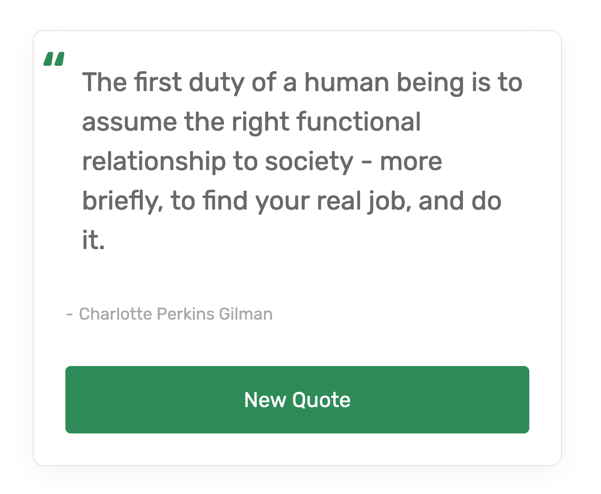

## Table of contents

- [Overview](#overview)
  - [Screenshot](#screenshot)
  - [Links](#links)
- [My process](#my-process)
  - [Built with](#built-with)
  - [Tools used](#tools-used)
  - [Project Overview](#project-overview)
  - [Continued development](#continued-development)
- [Author](#author)

## Overview

### Screenshot

### Links

- Solution URL: [View Code](https://github.com/Rabin92/random-quote-generator)
- Live Site URL: [Go Live](https://random-quote-git-main-rabin92.vercel.app/)

## My process

### Built with

- Semantic HTML5 markup
- Sass
- [JavaScript](https://javascript.info) - Vanilla JS
- [Flexbox](https://css-tricks.com/snippets/css/a-guide-to-flexbox/) - CSS Flexbox
- Mobile-first Responsive Design

### Tools used

- Visual Studio Code
- Git
- GitHub

### Project Overview

For this project, I used fetch API to request data from a 3rd party. I then converted the JSON data into JS objects and implemented the data on the webpage.

### Continued development

I will continue to learn about Asynchronous programming language.

## Author

- Website - [Rabin Gharti Magar](https://www.rabingm.dev/)
- Frontend Mentor - [@Rabin92](https://www.frontendmentor.io/profile/Rabin92)
